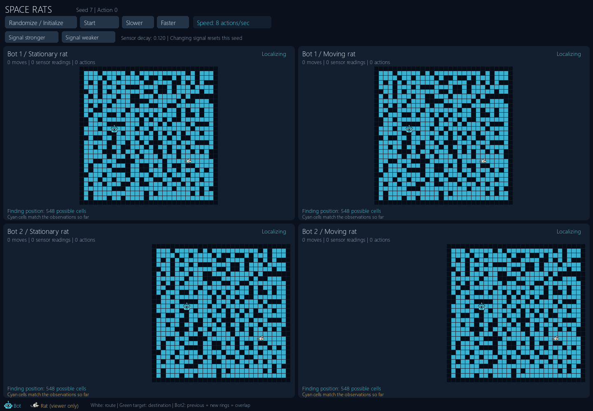
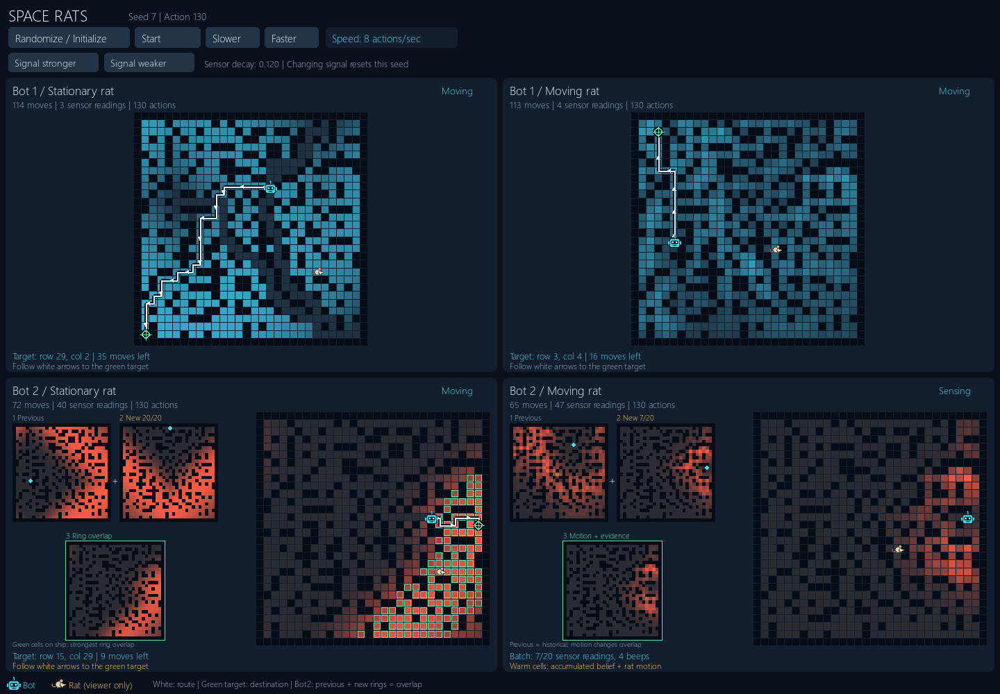

# Space Rats

**A robot must locate and capture a hidden rat inside a maze-like spaceship using as few sensing and movement actions as possible.** The robot knows the ship's layout, but neither its own starting position nor the rat's location. The rat may stay in one cell or move through neighboring open cells after each robot action.

The robot must first **localize itself** by comparing nearby wall counts and movement outcomes with the map. It then searches for the rat using a noisy detector: beeps become less likely with distance, but provide no direction or exact location. Similar-looking corridors make localization difficult, uncertain readings can send the robot toward the wrong cell, and a moving rat can leave before the robot arrives.

This project compares two strategies across **four scenarios: Bot1 and Bot2, each with a stationary and a moving rat**. Bot1 chooses a destination after one sensor reading; Bot2 collects 20 readings and combines probability rings from different sensing locations. The central tradeoff is whether gathering more evidence saves enough travel to justify its cost. The same ideas underpin robot navigation and tracking with imperfect sensors.



**Legend:** cyan robot; cream rat with pink tail (viewer only); dark walls. Cyan intensity shows Bot1 belief; warm intensity shows Bot2's combined probability rings. White arrows lead to the green destination crosshair. Green status means captured; red status means the budget expired.

**Recorded scenario:** the same 30 x 30 ship and starting positions, seed **7**, signal decay **0.12**, and a **400-action budget** per scenario. The GIF shows all four scenarios together from the actual simulation. Finished scenarios freeze while the others continue.

| Scenario | Outcome | Total actions | Moves | Sensor readings |
| --- | --- | ---: | ---: | ---: |
| Bot 1 / Stationary rat | Captured | 368 | 341 | 14 |
| Bot 1 / Moving rat | Captured | 205 | 183 | 9 |
| Bot 2 / Stationary rat | Captured | 308 | 110 | 180 |
| Bot 2 / Moving rat | Captured | 324 | 130 | 176 |

These outcomes come from actual seeded executions. Bot2's additional sensing helps in this stationary run but costs more in the moving run. Neither strategy always wins. Each GIF shows every action at 8 actions per second and holds the final state for 3 seconds.

## What Bot2 adds

| Stage | Bot1 | Bot2 | Why it matters |
| --- | --- | --- | --- |
| Find its own location | Filter possible locations with wall counts and movement outcomes; escape repeated-position loops | Filter the same observations while choosing random directions, as in its source code | Both begin tracking with a known position; their localization costs can differ |
| Gather evidence | One beep/no-beep reading at a sensing location | 20 readings while remaining at one location | Beep frequency provides a more stable distance estimate for a stationary rat |
| Choose a destination | Highest posterior-probability cell after a single reading | Highest combined-probability cell after a batch | Evidence from different locations can narrow a broad ring to a smaller region |
| Travel | Follow a shortest route to the chosen cell; sense again if the rat is absent | Same route-following cycle after each batch | More sensing can reduce wasted travel, but costs actions |
| Track a moving rat | Predict its next location after each action | Predict between every reading and move, including the 20-reading batch | Historical rings cannot be treated as fixed constraints on a moving target |

## How the AI works

1. **Localize through constraints.** The robot knows the map but not its position. An eight-neighbor wall count eliminates incompatible locations. Successful moves and wall bumps eliminate more possibilities. Bot1 normally tries a commonly open direction, with a five-position history detecting wiggling and triggering a random escape direction. Bot2's source code chooses random localization directions.
2. **Update belief with Bayes' rule.** Each possible rat cell has a probability. A beep generally supports shorter distances; silence generally supports longer distances. Neither observation alone proves where the rat is.
3. **Build Bot2's rings.** The number of beeps in 20 readings gives a likelihood for each distance. Because the detector uses Manhattan distance, equal-distance rings are diamond-shaped, interrupted by walls. The robot multiplies new likelihood evidence into its previous belief; overlapping regions receive more support. This is a soft probability update, not a hard geometric intersection.
4. **Move and repeat.** Breadth-first search finds a shortest route to the selected cell. Bots commit to that route and check encountered cells for the rat. If no capture occurs, they sense again from the destination.
5. **Predict motion.** In moving mode, each cell sends its probability mass equally to its open cardinal neighbors after every action. Cells previously found empty can become occupied again.

<details>
<summary>Watch ring evidence accumulate</summary>



The ship takes the largest square area available in each panel. Icons are about 1.7 cells wide (at least 14 pixels). White route arrows and a green destination crosshair show where the bot is heading; the caption gives the target row/column (one-based) and remaining moves.

- **Bot1 cyan fill:** accumulated rat-location belief.
- **Ring formation:** two labeled small maps show the previous batch and the new batch as each reading arrives; the third shows their likelihood product for stationary rats. Cyan dots mark sensing origins. The large ship highlights the strongest overlap and shows the accumulated belief used for movement. For moving rats the third map shows the actual motion-filtered belief, not a product of stale rings.
- **Bot2 warm fill:** accumulated probability shown as shaded ring intersections. Brighter cells have more support; blocked cells have none. The first batch produces a distance band, and subsequent observations concentrate or revise its overlap.
- **Moving rat:** the same warm heatmap also incorporates motion prediction after each action. It can spread or split through corridors; fixed diamond rings would misrepresent the implemented moving-target filter.

Each map scales intensity to its own peak, not a shared absolute probability scale. These are soft probabilities, not hard ring boundaries. The display uses the actual belief used to choose destinations, with green borders highlighting cells at least half the peak of the two-ring product (a display threshold, not a confidence interval). Algorithms, selected routes, random observations, and recorded outcomes are unchanged by this visual update.

</details>

<details>
<summary>Exact probability models and algorithm details</summary>

For different bot/rat cells, the detector likelihood is `p(j) = exp(-alpha * (Manhattan(bot, j) - 1))`, with `alpha > 0`. Larger signal decay makes long-range beeps rarer. Very small decay can also be uninformative because most readings beep.

For a single reading, update `b'(j) proportional to b(j) * p(j)` for a beep or `b(j) * (1-p(j))` for silence, then normalize over open cells. An exact empty-cell observation sets that cell's probability to zero and renormalizes the rest.

For a stationary rat, Bot2's batch likelihood is `L(j) = C(N,k) * p(j)^k * (1-p(j))^(N-k)`, where `N=20` and `k` is the beep count. The posterior is `b'(j) = b(j)L(j) / sum_i b(i)L(i)`. The common binomial coefficient cancels on normalization. The visualization computes the spatial likelihood in log space to avoid underflow and scales its maximum to one.

The engine updates after each reading. For a stationary rat, multiplying these sequential likelihoods gives the same normalized posterior as the binomial batch formula. A regression test verifies this equivalence. Decisions remain batch-based: Bot2 does not move until all 20 readings complete. Combining two sensing locations multiplies the previous posterior by the new likelihood once; it does not multiply in the previous prior again.

For a moving rat, `b_next(j) = sum_i b'(i) T(i,j)`, with `T(i,j)=1/degree(i)` for each open cardinal neighbor. An isolated cell retains its mass. Each new reading is followed by this prediction, and subsequent co-location evidence is applied. A simple count of beeps is no longer sufficient: their order matters because the hidden state changes between readings. The moving panel displays the full accumulated, motion-filtered belief as a warm heatmap.

Both bots choose the highest posterior cell, with row-major tie-breaking, and follow a BFS route until capture or arrival. They do not replan after every movement. The remaining route is drawn with white arrows. Walls and entity positions are stored separately, so rat movement cannot change traversability.

All four runs share terrain and starting positions. The two moving-target runs share an exogenous rat trajectory; the two stationary targets remain at their initial cell. Sensor uniform random numbers are matched by action number. Each bot thresholds that number using its own distance-dependent probability. Capturing in one counterfactual run does not stop the other's rat trajectory. A captured board freezes its target overlay at the capture cell.

Robot and rat initially occupy different cells. Once localized, the robot reconstructs its initial location using its movement displacement and conditions the initial rat prior on that cell being empty. For moving targets this prior is propagated through the elapsed transitions.

</details>

## Interactive demo

Install with Python **3.11-3.13**; verified here using **3.13.9**:

```powershell
python -m venv .venv
.venv\Scripts\python -m pip install -r requirements.txt
.venv\Scripts\python main.py
```

The window starts stopped with all four scenarios initialized in a 2 x 2 layout: Bot1 across the top row, Bot2 across the bottom; stationary targets in the left column and moving targets in the right. Click **Start** to begin. Use `python` directly if your environment is activated. No external assets or network access are needed at runtime.

Shared controls:

| Control | Action |
| --- | --- |
| Randomize / Initialize | Generate one fresh ship and matched starts; stop and reset all four scenarios |
| Start / Stop | Run or stop all four together; Start continues their current states |
| Slower | Halve playback speed, down to 1 action per second |
| Faster | Double playback speed, up to 32 actions per second |
| Signal stronger / Signal weaker | Decrease / increase sensor decay; reset the same seed and pause |

The comparison, sensing progress, selected routes, and Bot2's ring evidence display automatically. Resizing redraws everything at native resolution, with a minimum 800 x 720 window. Playback starts at 8 actions per second. Speed changes presentation timing only. A captured or budget-exhausted panel freezes independently; the other panels continue. After all four finish, initialize a new run. The displayed seed lets you reproduce any randomized scenario through the CLI. Stronger signal reduces alpha by 20%; weaker signal increases it by 25%, bounded to 0.02-2. Lower decay means beeps carry farther. Signal changes reset both environments with the same map and starting positions; they never mix different sensor models into an existing belief. The action counter shows elapsed actions only; `--limit` remains a configurable safety budget.

<details>
